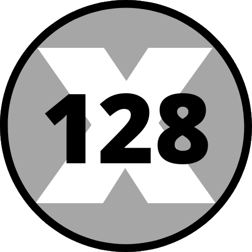

# x128 - Library Components 🔥

Hola! Bienvenido al mini proyecto de `x128`.

Aqui encontrarás los componentes publicados en nuestra [cuenta de Instagram](https://instagram.com/x128bit)! 👈

## <a href="https://x128-components.vercel.app/" target="_blank">Live Demo!! 💯</a>

## Instalación y ejecución

Para instalar dependencias ejecuta:

```bash
npm i
```

Para arrancar el entorno local:
```
npm run storybook
```

## Componentes actuales

A lo largo del tiempo se irá actualizando el repositorio con nuevas versiones con componentes:

* TextField
* CheckboxField
* Button


## License
[MIT](https://choosealicense.com/licenses/mit/)
